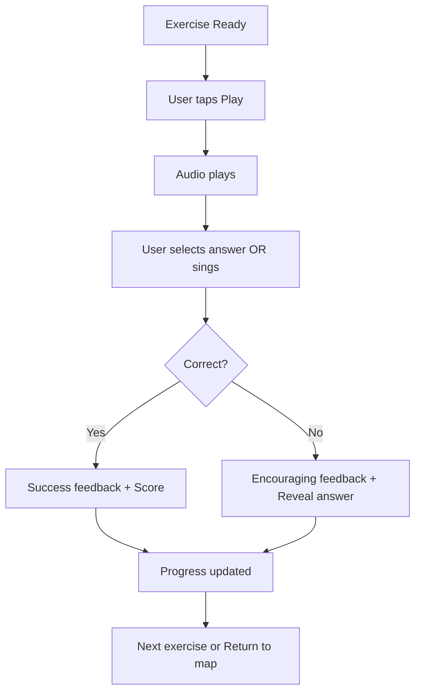

# UX Design Specification melora

**Author:** Charles
**Date:** 2026-03-01

---

<!-- UX design content will be appended sequentially through collaborative workflow steps -->

## Executive Summary

### Project Vision

Melora transforms ear training from a tedious technical process into an engaging learning journey through a multicultural musical landscape. The application develops true aural music literacy - the ability to read, write, and understand music through listening alone.

### Target Users

**Primary Personas:**

- **Quentin (16 years old):** Teenage guitarist looking to progress quickly with an engaging interface. He finds traditional ear training boring and needs gamification to stay motivated. Uses the app primarily on mobile during breaks.

- **Gaëlle (23 years old):** Music student needing a structured tool for her studies. She needs clear progression tracking and accessibility features. Uses the app for exam preparation with desktop sessions.

### Key Design Challenges

- **Gamification + Education Balance:** Creating engaging game mechanics without compromising pedagogical effectiveness
- **Audio Complexity:** Managing pitch detection, sample playback, and real-time feedback
- **Accessibility vs. Aesthetics:** Delivering rich visual experiences (Art Nouveau style) while maintaining WCAG Level A compliance
- **Micro-Sessions:** Designing satisfying experiences within 5-15 minute sessions

### Design Opportunities

- **Journey Map Visualization:** Represent musical progress through illustrated chapters (folk, blues, Celtic, classical, modal, jazz)
- **Reward System:** Badges and achievements that feel meaningful and motivating
- **Micro-Accomplishments:** Immediate feedback and sense of progression after each exercise
- **Musical Context:** Connecting abstract ear training to real musical styles

## Core User Experience

### Defining Experience

The core user action is completing ear training exercises - listening to a musical element (interval, chord, melody) and identifying it correctly. This exercise -> feedback -> progression cycle is the heartbeat of the entire application.

### Platform Strategy

- **Platform:** Web-based PWA (Progressive Web App)
- **Primary Device:** Mobile-first (touch), Desktop/Tablet (keyboard/mouse)
- **Offline Mode:** Full offline capability required - users train without internet
- **Audio Requirements:** Web Audio API for sample playback, microphone access for pitch detection

### Effortless Interactions

- **One-tap exercise launch:** Start an exercise with a single tap
- **Instant feedback:** Immediate response after each answer
- **Visible progression:** Journey map updates after each completed exercise
- **Easy audio replay:** Tap to replay sound if missed

### Critical Success Moments

- **Aha Moment:** First correct identification of a musical element
- **Unlock Moment:** Discovering a new chapter when progressing
- **First Session:** Completing the first exercise and understanding how it works

### Experience Principles

1. **Audio-first:** Everything centers around sound - if audio fails, the experience fails
2. **Instant feedback:** Every user action receives immediate response
3. **Visible progression:** Every completed exercise shows progress on the map
4. **Micro-sessions:** Respect user time - 5-15 min max per session

## Desired Emotional Response

### Primary Emotional Goals

- **Determined & Engaged:** Users feel motivated to continue progressing through exercises
- **Proud:** Users feel proud when they master a musical concept
- **Confident:** Users gain confidence in their musical ear abilities

### Emotional Journey Mapping

- **Discovery:** Curiosity and interest when seeing the artistic universe
- **Core Experience:** Focus and engagement during exercises
- **Post-Exercise:** Pride and accomplishment, motivation to continue
- **Return:** Anticipation and pleasure to return to the game
- **Error Handling:** Encouragement, not frustration - errors are part of learning

### Micro-Emotions

- **Confidence vs. Confusion:** Clear interface, no doubt about what to do
- **Excitement vs. Anxiety:** Discovering new chapters, no pressure
- **Accomplishment vs. Frustration:** Positive feedback, visible progression
- **Delight vs. Satisfaction:** Animations and rewards that create delight

### Design Implications

- **Accomplishment →** Positive feedback after each correct answer
- **Progression →** Map updates, badges earned
- **Encouragement →** Positive messages even on errors
- **Discovery →** Rich visual universe (Art Nouveau style)

### Emotional Design Principles

1. **Always celebrate progress** - Every correct answer deserves recognition
2. **Errors are learning opportunities** - Encouraging, never punishing
3. **Progress must be visible** - Every action shows advancement
4. **Make it delightful** - Animations, sounds, and surprises create engagement

## UX Pattern Analysis & Inspiration

### Inspiring Products Analysis

Based on the target users (Quentin - teen gamer, Gaëlle - music student), relevant inspiring products include:

**Duolingo (Gamification):**
- Excellent micro-session design (5-min max)
- Clear progression with visual rewards
- Immediate feedback with encouraging messages
- Bite-sized lessons that build confidence

**Yousician (Music Learning):**
- Real-time audio feedback
- Visual progress tracking
- Game-like progression system
- Accessible on multiple devices

**Tenuto / EarTrainer (Ear Training):**
- Clean exercise interface
- Progressive difficulty
- Clear visual feedback

### Transferable UX Patterns

**Navigation Patterns:**
- Tab-based navigation for quick access to different sections
- Persistent bottom navigation for main actions

**Interaction Patterns:**
- One-tap exercise start
- Swipe gestures for quick actions
- Pull-to-refresh for progress updates

**Visual Patterns:**
- Progress bars and completion indicators
- Badge/achievement celebration animations
- Card-based content organization

### Anti-Patterns to Avoid

- **Long exercises:** Users abandon after 2-3 minutes
- **Delayed feedback:** Immediate response is critical for ear training
- **Invisible progress:** Every action must show advancement
- **Complex navigation:** Single-tap access to core features
- **Punishing errors:** Encouragement, never punishment

### Design Inspiration Strategy

**What to Adopt:**
- Duolingo's micro-session approach
- Yousician's real-time feedback
- Clean exercise cards from ear training apps

**What to Adapt:**
- Gamification rewards for music-specific achievements
- Journey map visualization for musical progression

**What to Avoid:**
- Long, tedious exercises
- Complex settings menus
- Distracting visuals that take focus from audio

## Design System Foundation

### Design System Choice

**Custom Design System with Tailwind CSS**

A custom design system built on Tailwind CSS foundation, providing flexibility for the unique Art Nouveau visual style while maintaining consistency and development speed.

### Rationale for Selection

- **Visual Uniqueness:** Art Nouveau style requires custom design that standard systems cannot provide
- **Performance:** Tailwind produces minimal CSS bundle size - critical for PWA
- **Flexibility:** Full control over colors, typography, and animations
- **Accessibility:** Custom components with WCAG Level A compliance built-in
- **Team Size:** Single developer - custom system with reusable components is maintainable

### Implementation Approach

- Create custom component library in Svelte
- Use Tailwind CSS for utility classes and design tokens
- Build custom animations for gamification elements
- Design musical notation components (note display, interval visualization)
- Implement accessible audio controls

### Customization Strategy

- **Design Tokens:** Define custom color palette, typography, spacing
- **Component Library:** Build reusable UI components (buttons, cards, modals)
- **Musical Components:** Create music-specific components (piano keyboard, note display)
- **Animation System:** Custom animations for rewards, progress, transitions
- **Accessibility Layer:** ARIA labels, keyboard navigation, screen reader support

## 2. Core User Experience

### 2.1 Defining Experience

**"Listen to a musical element and identify it correctly"**

The defining interaction is completing ear training exercises - listening to a musical element (interval, chord, melody) and identifying it correctly. This is what users will describe to friends: "I listen to an interval/chord and have to guess what it is."

### 2.2 User Mental Model

- Users bring their musical knowledge (or lack thereof)
- They expect to hear the sound clearly
- They want immediate feedback on their answer
- Progress must be visible after each exercise

### 2.3 Success Criteria

- **Response < 1 second** after submission
- **Visual + audio feedback** for each answer
- **Visible progression** after each exercise
- **One tap/click** to start

### 2.4 Novel UX Patterns

- **Established:** Music ear training exercises (Tenuto, EarTrainer)
- **Innovation:** Gamification with multicultural musical universe, visual journey map

### 2.5 Experience Mechanics

**1. Initiation:**
- User taps exercise from journey map or exercise list
- Single tap to start - no complex setup

**2. Interaction:**
- User listens to musical element (play button)
- User selects answer from multiple choices OR sings the note
- Single tap to submit answer

**3. Feedback:**
- Immediate visual feedback (correct/incorrect)
- Audio feedback (success sound or gentle encouragement)
- Correct answer revealed if wrong

**4. Completion:**
- Score displayed with animation
- Progress bar updated
- "Next exercise" or "Back to map" options

## Visual Design Foundation

### Color System

**Art Nouveau Theme - "Mystical Musical Journey"**

Based on the Art Nouveau style with Eastern and Middle-Eastern influences:

- **Primary Colors:** Deep purple (#2D1B4E), Rich gold (#D4AF37)
- **Secondary Colors:** Teal (#1A5F5F), Burgundy (#722F37)
- **Accent Colors:** Warm cream (#F5E6D3), Soft rose (#E8B4B8)
- **Background:** Dark navy (#1A1A2E) for immersive focus
- **Success:** Emerald green (#2ECC71)
- **Error:** Soft coral (#E74C3C)
- **Text:** Off-white (#F5F5F5) on dark, Deep charcoal (#2D2D2D) on light

**Accessibility:** All color combinations meet WCAG Level A contrast requirements.

### Typography System

**Tone:** Elegant, timeless, slightly whimsical

- **Primary Font:** Display serif for headings (e.g., Playfair Display)
- **Secondary Font:** Clean sans-serif for body text (e.g., Inter)
- **Monospace:** For musical notation elements

**Type Scale:**
- H1: 2.5rem (40px)
- H2: 2rem (32px)
- H3: 1.5rem (24px)
- Body: 1rem (16px)
- Small: 0.875rem (14px)

### Spacing & Layout Foundation

**Layout Philosophy:** Airy and spacious, organic flow

- **Base Unit:** 8px grid system
- **Spacing Scale:** 4, 8, 16, 24, 32, 48, 64px
- **Content Max Width:** 480px for exercises (mobile-first)
- **Container Padding:** 24px on mobile, 48px on desktop

**Layout Principles:**
- Card-based content organization
- Generous whitespace for focus during exercises
- Bottom navigation for mobile, top for desktop
- Journey map as primary navigation element

### Accessibility Considerations

- **Contrast Ratios:** Minimum 4.5:1 for text
- **Focus Indicators:** Visible focus states for keyboard navigation
- **Screen Reader Support:** ARIA labels on all interactive elements
- **Touch Targets:** Minimum 44x44px for mobile
- **Font Scaling:** Support up to 200% browser zoom

## Design Direction Decision

### Design Directions Explored

Six distinct design directions were explored for Melora:

1. **"Royal Journey"** - Purple/gold theme with royal accents
2. **"Mystical Orient"** - Eastern aesthetics with decorative patterns
3. **"Celtic Whimsy"** - Celtic patterns with natural colors
4. **"Jazz Night"** - Jazz nightclub vibe with neon accents
5. **"Minimal Focus"** - Clean design for concentration
6. **"Musical Score"** - Music sheet theme

### Chosen Direction

**"Mystical Orient" - Art Nouveau with Eastern Influences**

This direction best aligns with the project's vision of a multicultural musical journey through an Art Nouveau aesthetic with Eastern and Middle-Eastern influences.

### Design Rationale

- **Visual Alignment:** Art Nouveau style with flowing lines and organic shapes matches the musical journey concept
- **Emotional Goals:** Creates curiosity, discovery, and cultural richness
- **Uniqueness:** Distinctive visual identity not found in competitor apps
- **Practical:** Dark background reduces eye strain during audio exercises
- **Accessible:** High contrast colors maintain WCAG compliance

### Implementation Approach

- Apply Art Nouveau decorative borders and frames
- Use flowing, organic shapes for cards and containers
- Implement gold accent colors for achievements and rewards
- Create chapter-specific color variations (folk = warm, jazz = cool)
- Design decorative header/footer elements for each musical universe

## User Journey Flows

### Journey 1: Starting an Exercise

**Flow:**
```
User opens app → Journey Map displayed → User taps chapter → 
Exercise list shown → User taps exercise → Exercise ready
```

**Entry Points:**
- From Journey Map (main entry)
- From Exercise Library (secondary entry)
- From Daily Challenge (quick entry)

### Journey 2: Completing an Exercise



**Key Interactions:**
- Play button triggers audio
- Multiple choice: tap to select, tap submit
- Singing: hold mic button, release to submit
- Immediate visual + audio feedback

### Journey 3: Progressing Through Journey Map

**Flow:**
```
Complete exercise → Score calculated → 
Progress bar updated → Chapter progress updated →
{Unlock new chapter?} → Celebration if unlocked
```

### Journey Patterns

**Navigation Patterns:**
- Bottom navigation for primary sections (Map, Library, Profile)
- Back button always available
- Breadcrumb for deep navigation

**Decision Patterns:**
- Clear CTAs at each decision point
- Options presented as cards or lists
- Default selection for power users

**Feedback Patterns:**
- Immediate response to all actions
- Progress indicators during loading
- Success/error states clearly distinguished

### Flow Optimization Principles

1. **Minimize steps to value:** One tap to start exercise from map
2. **Reduce cognitive load:** Show only relevant info per step
3. **Clear feedback:** Every action has visible result
4. **Graceful errors:** Recovery without penalty
5. **Delight moments:** Celebrations on achievements

## Component Strategy

### Design System Components

Using custom Tailwind CSS design system with reusable utility classes and design tokens:
- Buttons (primary, secondary, ghost variants)
- Cards (with decorative borders for Art Nouveau style)
- Input fields (for settings and forms)
- Navigation (bottom nav for mobile, top nav for desktop)
- Modals and dialogs

### Custom Components

**JourneyMap Component**
- Purpose: Visual navigation through musical chapters
- States: locked, available, in-progress, completed
- Variants: full-screen, mini-map in header

**ExerciseCard Component**
- Purpose: Display exercise in lists
- States: default, hover, active, locked
- Variants: compact, full info

**AudioPlayer Component**
- Purpose: Play musical audio samples
- States: idle, playing, loading, error
- Variants: simple play, with waveform

**AnswerButtons Component**
- Purpose: Multiple choice answers
- States: default, selected, correct, incorrect, disabled
- Variants: 2, 3, 4, or 6 options

**PitchDetector Component**
- Purpose: Visualize sung pitch in real-time
- States: idle, listening, detected, success, miss
- Variants: simplified, detailed

**ProgressBar Component**
- Purpose: Show progress in exercise and chapter
- States: empty, partial, complete
- Variants: horizontal, circular

**BadgeDisplay Component**
- Purpose: Show achievements and rewards
- States: locked, unlocked, new
- Variants: small icon, full badge

**ChapterHeader Component**
- Purpose: Thematic header for each musical chapter
- States: locked, available, active
- Variants: unique decorative border per chapter

### Component Implementation Strategy

- Build components as Svelte components
- Use Tailwind CSS for styling
- Create component variants using props
- Ensure all components are keyboard accessible
- Add ARIA labels for screen readers

### Implementation Roadmap

**Phase 1 - Core Components (MVP):**
- ExerciseCard, AudioPlayer, AnswerButtons - for critical exercise flow
- ProgressBar - for visible progression

**Phase 2 - Supporting Components:**
- JourneyMap - for navigation and progression visualization
- ChapterHeader - for thematic experience

**Phase 3 - Enhancement Components:**
- BadgeDisplay - for rewards and achievements
- PitchDetector - for vocal exercises

## UX Consistency Patterns

### Button Hierarchy

**Primary Buttons:**
- Use: Main actions (Start Exercise, Submit Answer)
- Style: Gold background (#D4AF37), white text
- Size: Full width on mobile, min-width 120px on desktop
- States: default, hover (lighter), active (darker), disabled (50% opacity)

**Secondary Buttons:**
- Use: Supporting actions (Replay, Back)
- Style: Transparent with gold border
- Size: Same as primary

**Ghost Buttons:**
- Use: Tertiary actions (Skip, Cancel)
- Style: Text only, no background
- Hover: Subtle underline

### Feedback Patterns

**Success Feedback:**
- Visual: Green checkmark + success message + score animation
- Audio: Pleasant success chime
- Behavior: Auto-advance after 1.5s or tap to continue

**Error Feedback:**
- Visual: Gentle red indicator + encouraging message
- Audio: Soft "try again" tone
- Behavior: Show correct answer, encourage to continue

**Loading States:**
- Visual: Animated spinner or progress indicator
- Text: "Loading..." or specific loading message
- Behavior: Disable interaction during loading

### Navigation Patterns

**Mobile Navigation:**
- Bottom navigation bar with 3-4 primary destinations
- Icons with labels
- Active state: highlighted with accent color

**Desktop Navigation:**
- Top navigation bar
- Journey map accessible from home
- Breadcrumbs for deep navigation

### Empty States

**No Progress Yet:**
- Encouraging illustration
- "Start your musical journey" CTA
- Brief explanation of value

### Form Patterns

**Settings Forms:**
- Clear section headers
- Immediate validation feedback
- Save confirmation toast

### Accessibility in Patterns

- All interactive elements: keyboard focusable
- Focus indicators: visible outline
- ARIA labels: on all buttons and controls
- Touch targets: minimum 44x44px

## Responsive Design & Accessibility

### Responsive Strategy

**Mobile (320px - 767px):**
- Bottom navigation bar (Map, Library, Profile)
- Single column layout
- Touch-optimized controls
- Full-screen exercise view

**Tablet (768px - 1023px):**
- Touch-optimized with larger touch targets
- Two-column layouts where appropriate
- Enhanced information density

**Desktop (1024px+):**
- Top navigation bar
- Multi-column layouts
- Optional side navigation
- Keyboard shortcuts

### Breakpoint Strategy

- Mobile: 320px - 767px
- Tablet: 768px - 1023px
- Desktop: 1024px+
- Use mobile-first media queries

### Accessibility Strategy

**WCAG Level A** (required by PRD):
- Color contrast ratios minimum 4.5:1
- Full keyboard navigation
- Screen reader support (ARIA labels)
- Touch targets minimum 44x44px
- Visible focus indicators
- Skip links for main content

### Testing Strategy

**Responsive Testing:**
- Real device testing (phone, tablet, desktop)
- Cross-browser testing (Chrome, Firefox, Safari, Edge)
- Network performance testing

**Accessibility Testing:**
- Automated accessibility testing tools
- Screen reader testing (VoiceOver, NVDA)
- Keyboard-only navigation testing
- Color blindness simulation

### Implementation Guidelines

**Responsive Development:**
- Use relative units (rem, %, vw, vh) over fixed pixels
- Mobile-first media queries
- Test touch targets and gesture areas
- Optimize images for different devices

**Accessibility Development:**
- Semantic HTML structure
- ARIA labels and roles
- Keyboard navigation implementation
- Focus management and skip links
- High contrast mode support
